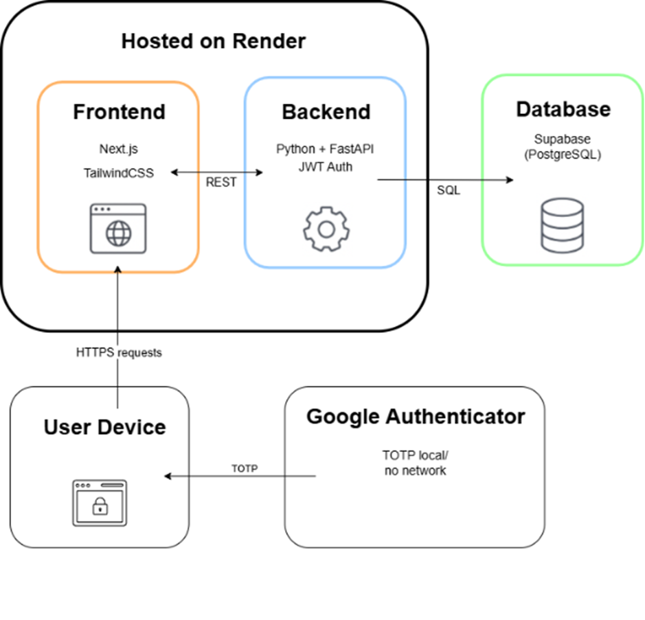
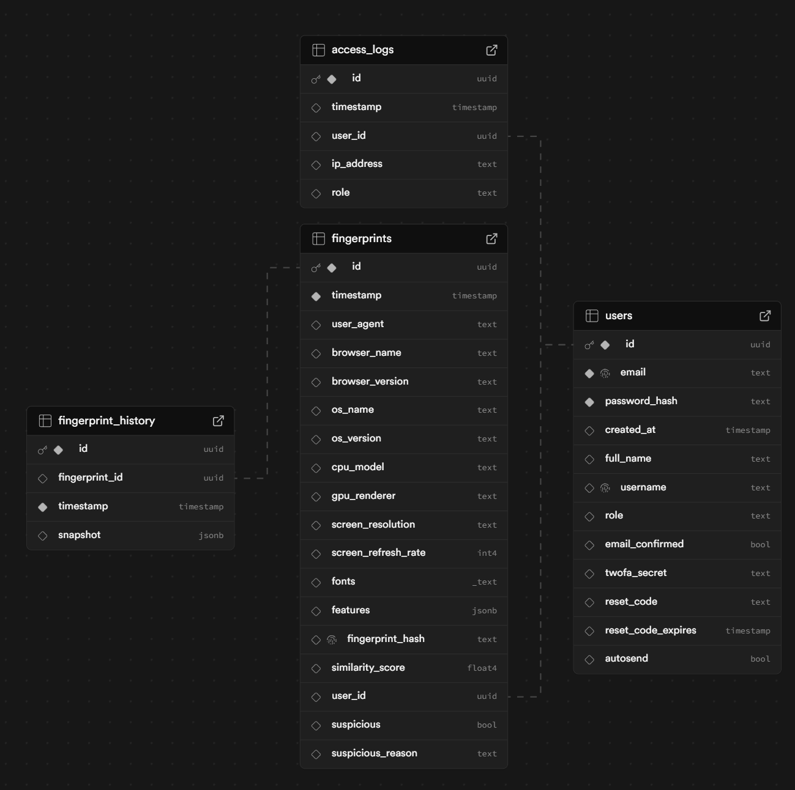
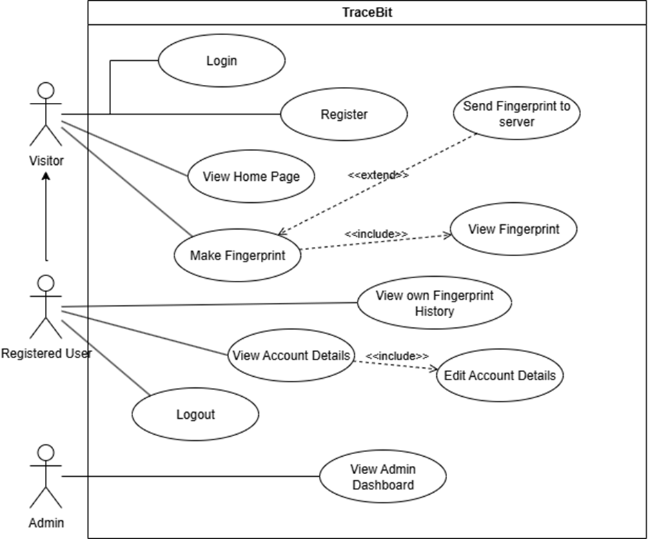

# TraceBit

🌐 [Dostop do aplikacije](https://trace-bit.onrender.com/)<br>
📘 [Dokumentacija](https://github.com/Majst0rL/TraceBit/tree/Master/Documentation)<br>
🎥 [Predstavitveni video spletne strani](https://www.youtube.com/watch?v=vRnXrCfuAvo&ab_channel=TraceBit)<br>
🎫 [Upravljanje nalog](https://github.com/Majst0rL/TraceBit/blob/Master/Documentation/Trace_Bit_Porocilo_dela.pdf)<br>

# O projektu
<b>TraceBit</b> je spletna platforma za zbiranje, analizo in vizualizacijo podatkov o brskalnikih 
in napravah. <br><br>
Glavni cilji so:
<ul>
  <li>
    preučevanje unikatnosti in ranljivosti digitalnih odtisov,
  </li>
  <li>
    zaznavanje anomalij,
  </li>
  <li>
    prikaz zgodovinske spremembe digitalnih odtisov,  
  </li>
  <li>
    anonimizacija podatkov brez ali z minimalnim zbiranjem osebnih informacij,  
  </li>
  <li>
    omogočanje vpogleda zbranih podatkov.  
  </li>
</ul>

Platforma temelji na oblačni infrastrukturi (Render, Supabase) in je dostopna prek 
spletnega vmesnika in REST API-jev. Namenjena je raziskovalcem zasebnosti in vsem, ki 
želijo razumeti svojo spletno izpostavljenost. 

# Arhitektura sistema
Aplikacija je zasnovana po modularni arhitekturi z jasno ločitvijo med frontendom, backendom in podatkovno bazo. Uporabljene so sodobne tehnologije, ki zagotavljajo varnost, skalabilnost in enostavno vzdrževanje. 
<ul>
  <li><b>Frontend:</b> Next.js, TailwindCSS <br></li>
  <li><b>Backend:</b> Python + FastAPI + JWT <br></li>
  <li><b>Podatkovna baza:</b> Supabase (PostgreSQL) <br></li>
  <li><b>Avtentikacija, varnost in nadzor:</b> JWT + TOTP (Google Authenticator) <br></li>
  <li><b>Gostovanje:</b> Render + Supabase</li>
</ul>




# Shema Supabase



# UML Use Case Diagrami




# Deployment

## 🔷 Hosting
### Render (Frontend)
Frontend je zgrajen z ogrodjem Next.js in gostovan na Renderju kot statična ali SSR aplikacija. 
Render nudi:
<ul>
  <li>✅ HTTPS certifikat (samodejno)</li>
  <li>✅ Upravljanje okoljskih spremenljivk (ENV)</li>
  <li>✅ Health-check funkcionalnost</li>
  <li>✅ Samodejni deploy ob Git push izbranega branch-a</li>
  <li>✅ Podpora za npm build in npm start skripte</li>
</ul>

Frontend dostopa do backenda prek NEXT_PUBLIC_BACKEND_URL okoljske spremenljivke.

### Render (Backend)
Backend je implementiran z FastAPI (Python) in prav tako gostovan na Render platformi kot Web Service.
Render omogoča:
<ul>
  <li>✅ HTTPS certifikat in avtomatski deploy iz GitHub repozitorija</li>
  <li>✅ Varno shranjevanje občutljivih podatkov (.env)</li>
  <li>✅ Povezavo s Supabase z uporabo REST API-jev (prek Supabase Python SDK)</li>
  <li>✅ Upravljanje background taskov in async podpore</li>
</ul>

Backend komunicira s Supabase preko REST/RPC klicev z uporabo:
•	SUPABASE_URL
•	SUPABASE_SERVICE_KEY

Za varnost se uporablja JWT avtentikacija, podpisana z algoritmom HS256.

[Render dokumentacija](https://render.com/docs)

## 🔷 Lokalna vzpostavitev

### 1. Kloniranje repozitorija

```powershell
git clone https://github.com/Majst0rL/TraceBit.git
```

### 2. Konfiguracija okolja

Ustvari datoteko `.env` v korenski mapi (backend) in vanjo dodaj naslednje:

```env
SUPABASE_URL=https://example.supabase.co
SUPABASE_SERVICE_KEY=<your_service_role_key>
JWT_SECRET_KEY=<YourJWTSecret>
MAIL_USERNAME=example@gmail.com
MAIL_PASSWORD=example
MAIL_FROM=example@gmail.com
MAIL_SERVER=smtp.gmail.com
MAIL_PORT=587
MAIL_STARTTLS=True
MAIL_SSL_TLS=False
```

Ustvari še datoteko `.env.local` na frontend korenski mapi in vanjo dodaj:

```env
NEXT_PUBLIC_API_URL=http://localhost:8000
```

### 3. Zagon frontenda

```bash
cd TraceBit/frontend
npm install
npm run dev
```

Frontend bo dostopen na: [http://localhost:3000](http://localhost:3000)

### 4. Zagon backenda

```bash
cd TraceBit/backend
uvicorn main:app --host 0.0.0.0 --port 8000 --reload
```

Backend bo poslušal na: [http://localhost:8000](http://localhost:8000)

# Testiranje

Za zagotavljanje kakovosti in pravilnega delovanja sistema smo uporabili kombinacijo enotnega testiranja (unit tests), statične analize kode in ročnega preverjanja funkcionalnosti z vidika končnega uporabnika. <br>

SonarCloud: Za avtomatizirano statično analizo kode uporabljamo SonarCloud, ki nam pomaga odkriti potencialne napake, varnostne ranljivosti in izboljšati kvaliteto kode.    <br> 
Pytest: Za izvajanje enotnih testov uporabljamo Pytest, ki omogoča enostavno pisanje in zagon testov.  <br>

# MFA zaščita
Uporabniki ob registraciji vključijo MFA (TOTP) z uporabo Google Authenticator. Skrivnost se enkriptira in shrani v supabase. MFA se preverja ob prijavi.

# Celotna dokumentacija
Vse podrobnosti, opisi, tehnični diagrami in preostala dokumentacija so dostopni na:
[Dokumentacija](https://github.com/Majst0rL/TraceBit/tree/Master/Documentation)


